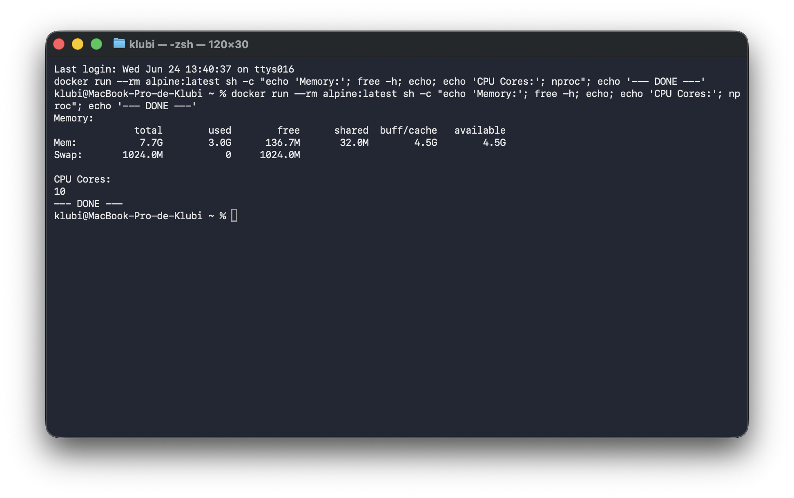
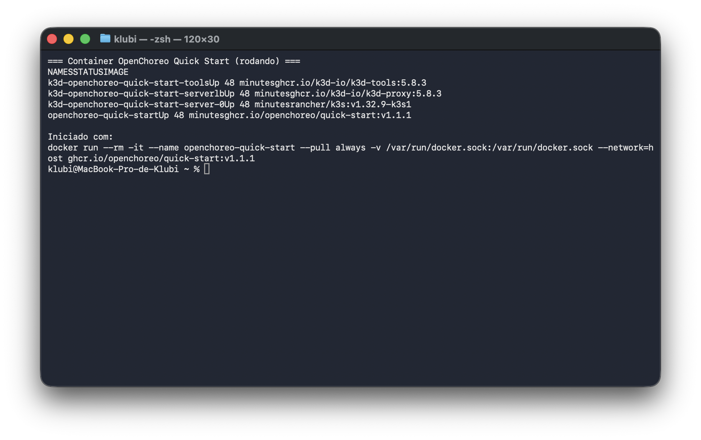
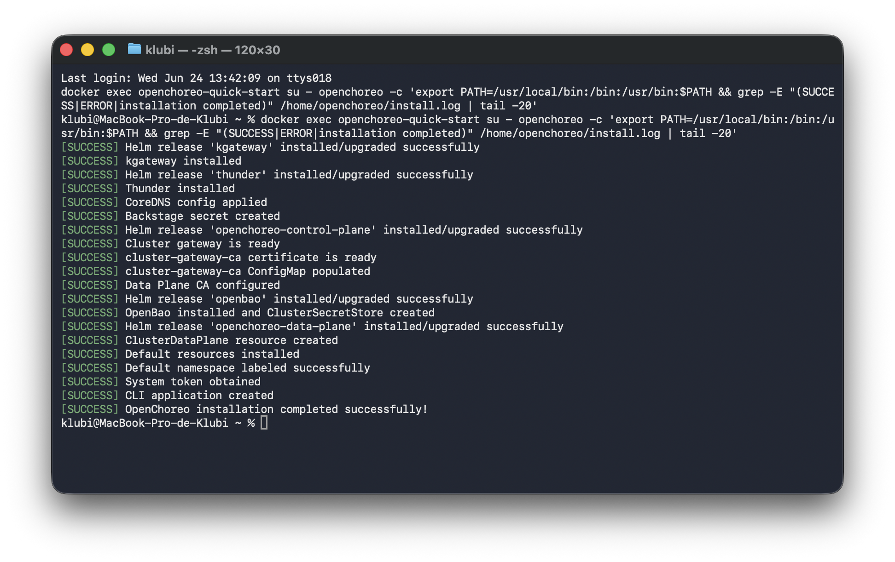
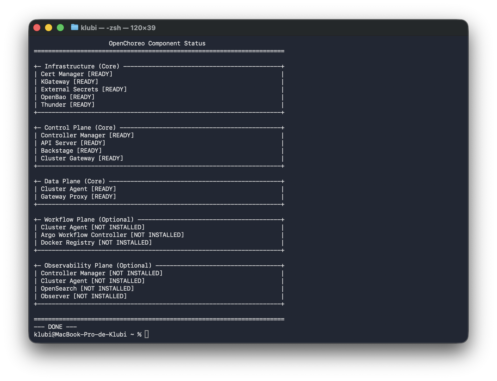
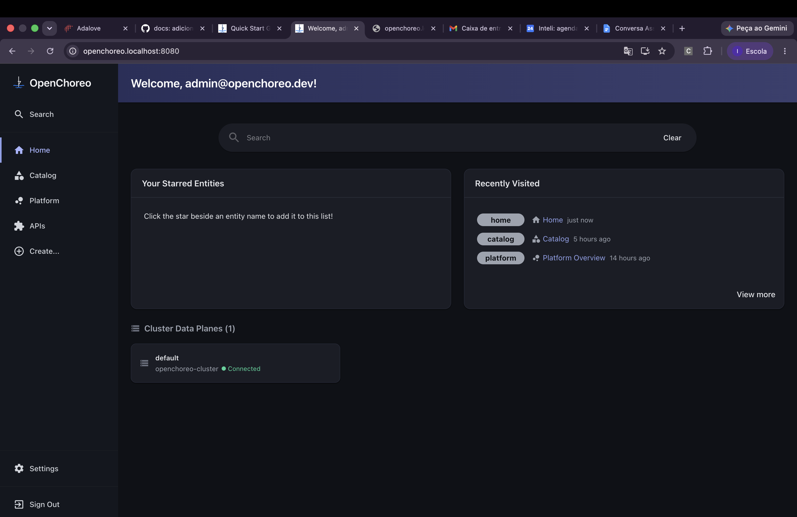
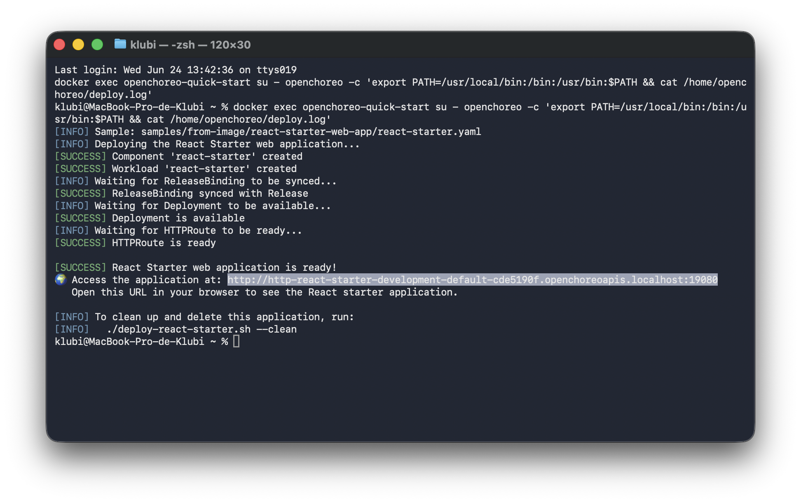
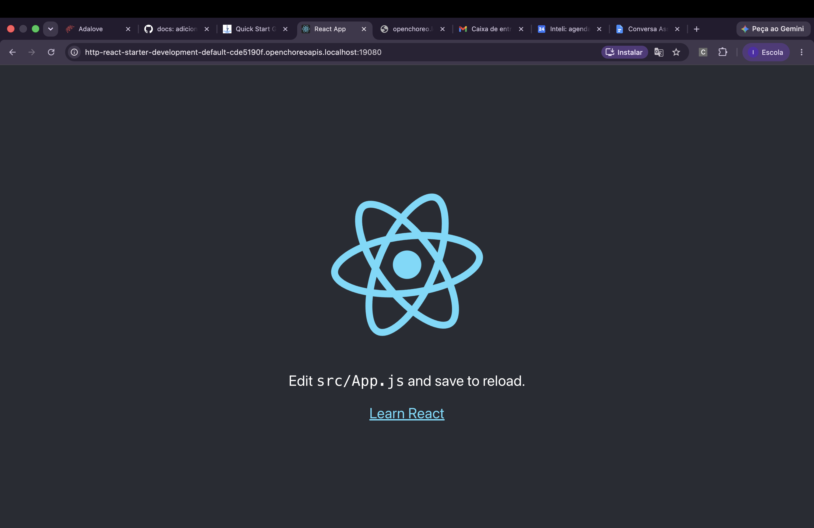
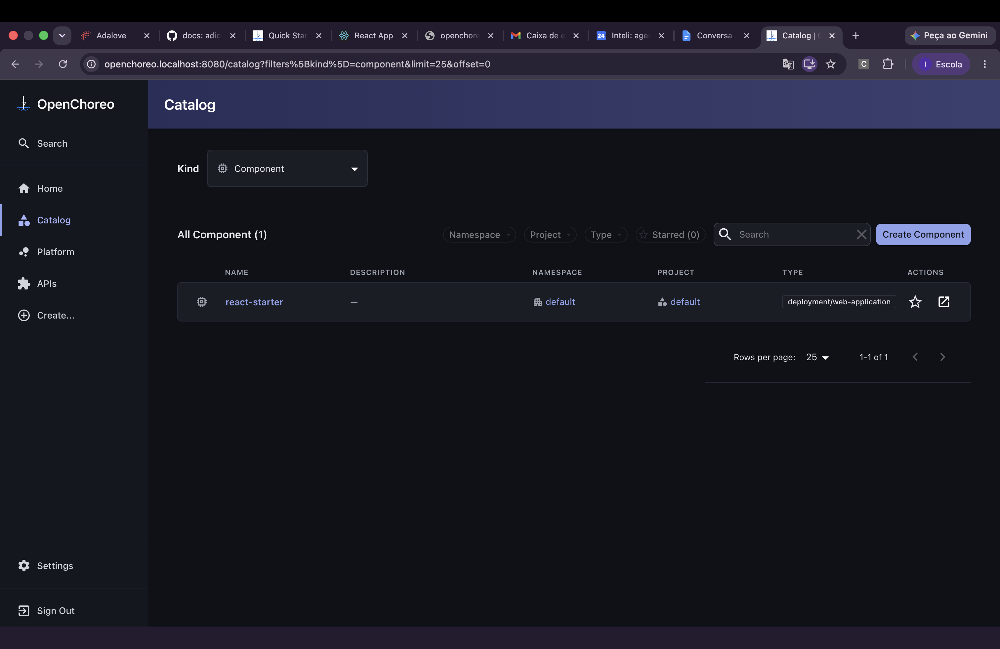
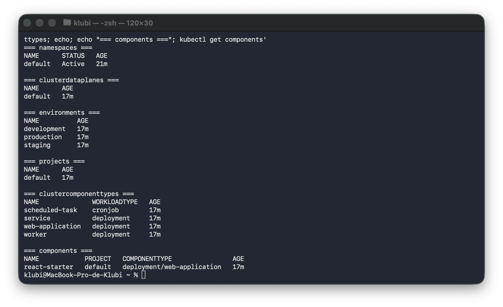

# Instalação e validação do OpenChoreo (v1.1.1)

Documentação da atividade ponderada: instalação do OpenChoreo em ambiente local via Quick Start, validação da interface, publicação da aplicação de exemplo e consulta aos recursos do Kubernetes.

### Ordem de execução

1. Configuração do ambiente (seção 1)
2. Quick Start e `./install.sh` — instalação completa com sucesso (seção 2)
3. Validação da interface web (seção 3)
4. Deploy do `react-starter` — publicado com sucesso (seção 4)
5. Consultas `kubectl` (seção 5)
6. Conclusão (seção 6)

---

## 1. Ambiente utilizado

### Hardware e sistema operacional

| Item | Valor |
|------|-------|
| Equipamento | MacBook Pro (Apple M4) |
| Sistema operacional | macOS 26.3 (Build 25D125) |
| Memória física | 16 GB |
| CPUs físicas | 10 (4 performance + 6 efficiency) |

### Runtime Docker

| Item | Valor |
|------|-------|
| Runtime | Docker Desktop 4.55.0 |
| Versão Docker Client | 29.5.1 |
| CPUs visíveis nos containers | 10 |
| Memória visível nos containers | 7,7 GB total / 4,4 GB disponível |
| Disco disponível | 418 GB |

### Verificação de recursos (comando do guia)

```bash
docker run --rm alpine:latest sh -c "echo 'Memory:'; free -h; echo; echo 'CPU Cores:'; nproc"
```

Saída:

```
Memory:
              total        used        free      shared  buff/cache   available
Mem:           7.7G        3.0G      117.5M       32.1M        4.5G        4.4G
Swap:       1024.0M           0     1024.0M

CPU Cores:
10
```



---

## 2. Instalação

### Comando para iniciar o Dev Container

```bash
docker run --rm -it --name openchoreo-quick-start \
  --pull always \
  -v /var/run/docker.sock:/var/run/docker.sock \
  --network=host \
  ghcr.io/openchoreo/quick-start:v1.1.1
```

### Quick Start em execução



### Comando de instalação

Dentro do container Quick Start:

```bash
./install.sh --version v1.1.1
```

### Tempo aproximado

Cerca de **12 minutos**.

### Resultado da instalação

A instalação foi concluída com **sucesso completo** (exit code 0). Todos os componentes principais foram instalados e ficaram em estado Ready:

| Componente | Resultado |
|------------|-----------|
| Verificação de pré-requisitos | Aprovada |
| Recursos do sistema (10 CPUs, 7 GB RAM) | Atendem aos requisitos |
| k3d cluster `openchoreo-quick-start` | Criado com sucesso |
| cert-manager | Instalado (3/3 pods Ready) |
| External Secrets Operator | Instalado (3/3 pods Ready) |
| Gateway API CRDs | Instalados |
| kgateway v2.2.1 | Instalado |
| Thunder 0.28.0 | Instalado (1/1 pod Ready) |
| CoreDNS custom config | Aplicada |
| OpenChoreo Control Plane | Instalado |
| Cluster Gateway | Pronto |
| OpenBao | Instalado e ClusterSecretStore criado |
| OpenChoreo Data Plane | Instalado (2/2 pods Ready) |
| ClusterDataPlane resource | Criado |
| Default resources | Instalados |
| OCC CLI | Configurado |

Mensagem final do script:

```
[SUCCESS] OpenChoreo installation completed successfully!
[INFO]   Backstage UI: http://openchoreo.localhost:8080/
[INFO]     Username: admin@openchoreo.dev
[INFO]     Password: Admin@123
```



### Status pós-instalação (`./check-status.sh`)

```
+- Infrastructure (Core) ----+
| Cert Manager   [READY]     |
| KGateway       [READY]     |
| External Secrets [READY]   |
| OpenBao        [READY]     |
| Thunder        [READY]     |
+----------------------------+

+- Control Plane (Core) -----+
| Controller Manager [READY] |
| API Server         [READY] |
| Backstage          [READY] |
| Cluster Gateway    [READY] |
+----------------------------+

+- Data Plane (Core) --------+
| Cluster Agent  [READY]     |
| Gateway Proxy  [READY]     |
+----------------------------+
```



---

## 3. Validação da interface

| Campo | Valor |
|-------|-------|
| URL | http://openchoreo.localhost:8080 |
| Usuário | `admin@openchoreo.dev` |
| Senha | `Admin@123` |

A interface do OpenChoreo (baseada no Backstage) foi acessada com sucesso após a instalação. O Backstage ficou com status `[READY]` no `./check-status.sh`, confirmando que a interface está plenamente operacional.



---

## 4. Publicação da aplicação de exemplo

### Comando executado

```bash
./deploy-react-starter.sh
```

### Resultado

O deploy foi concluído com **sucesso completo**. Todas as etapas foram executadas sem erros:

```
[SUCCESS] Component 'react-starter' created
[SUCCESS] Workload 'react-starter' created
[SUCCESS] ReleaseBinding synced with Release
[SUCCESS] Deployment is available
[SUCCESS] HTTPRoute is ready

[SUCCESS] React Starter web application is ready!
🌍 Access the application at:
   http://http-react-starter-development-default-cde5190f.openchoreoapis.localhost:19080
```

**URL da aplicação:** `http://http-react-starter-development-default-cde5190f.openchoreoapis.localhost:19080`

A URL retorna HTTP 200, confirmando que a aplicação está servindo requisições.







---

## 5. Recursos do Kubernetes

Comandos executados dentro do container Quick Start após o deploy.

### Namespaces

```bash
kubectl get namespaces -l openchoreo.dev/control-plane=true
```

```
NAME      STATUS   AGE
default   Active   4m12s
```

**Explicação:** *Namespaces* são unidades de isolamento dentro do cluster Kubernetes. A label `openchoreo.dev/control-plane=true` identifica o namespace pertencente ao control plane do OpenChoreo. O namespace `default` foi marcado com essa label pelo script de instalação, confirmando que o control plane está ativo.

---

### ClusterDataPlanes

```bash
kubectl get clusterdataplanes
```

```
NAME      AGE
default   20s
```

**Explicação:** *ClusterDataPlanes* são recursos CRD que registram os planos de dados no OpenChoreo — clusters Kubernetes onde as aplicações são efetivamente executadas. A presença do `default` confirma que o data plane foi configurado com sucesso durante a instalação. Sem esse recurso, aplicações não teriam destino de execução.

---

### Environments

```bash
kubectl get environments
```

```
NAME          AGE
development   22s
production    22s
staging       22s
```

**Explicação:** *Environments* (ambientes) representam contextos de execução das aplicações. Os ambientes `development`, `staging` e `production` são criados automaticamente pelo OpenChoreo e definem **onde** cada versão de uma aplicação pode ser publicada. O `react-starter` foi publicado no ambiente `development`, como indicado pela URL gerada.

---

### Projects

```bash
kubectl get projects
```

```
NAME      AGE
default   23s
```

**Explicação:** *Projects* (projetos) são unidades organizacionais que agrupam componentes e aplicações relacionadas dentro da plataforma. O projeto `default` é criado automaticamente e foi usado pelo `react-starter` como domínio de organização.

---

### ClusterComponentTypes

```bash
kubectl get clustercomponenttypes
```

```
NAME              WORKLOADTYPE   AGE
scheduled-task    cronjob        26s
service           deployment     26s
web-application   deployment     26s
worker            deployment     26s
```

**Explicação:** *ClusterComponentTypes* definem os tipos de componentes suportados pela plataforma em nível de cluster. Cada tipo determina como um componente é implantado e exposto: `web-application` e `service` usam `deployment`; `scheduled-task` usa `cronjob`. O `react-starter` utiliza o tipo `web-application`.

---

### Components

```bash
kubectl get components
```

Antes do deploy:
```
No resources found in default namespace.
```

Após o deploy:
```
NAME            PROJECT   COMPONENTTYPE                AGE
react-starter   default   deployment/web-application   24s
```

**Explicação:** *Components* são as unidades implantáveis no OpenChoreo. Cada componente representa uma aplicação ou serviço, com seu tipo, projeto de origem e tempo desde a criação. O `react-starter` aparece aqui como confirmação de que o deploy criou o recurso corretamente na plataforma.



---

## 6. Conclusão

### Resumo

| Etapa | Status |
|-------|--------|
| Ambiente local (macOS + Docker Desktop) | Configurado |
| Quick Start + instalação v1.1.1 | **Completa** — todos os componentes READY |
| Interface web (`http://openchoreo.localhost:8080`) | Acessível |
| Deploy `react-starter` | **Publicado com sucesso** |
| URL da aplicação | `http://http-react-starter-development-default-cde5190f.openchoreoapis.localhost:19080` |
| Recursos Kubernetes | Namespaces, ClusterDataPlane, Environments, Projects, ComponentTypes, Components — todos presentes |

### O que foi alcançado

- Instalação completa do OpenChoreo v1.1.1 via Quick Start com todos os componentes em estado Ready
- Interface Backstage acessível e autenticada
- Aplicação `react-starter` publicada e servindo requisições (HTTP 200)
- Recursos da plataforma (environments, projects, clustercomponenttypes) criados e visíveis via `kubectl`
- Fluxo completo de publicação validado: criação de componente → workload → ReleaseBinding → Deployment → HTTPRoute

### Observações técnicas

- O `./install.sh` utiliza k3d para criar um cluster Kubernetes local dentro do Docker; as portas são mapeadas automaticamente (8080, 19080, etc.)
- O runtime Docker Desktop 4.55.0 (Apple Silicon) processou toda a instalação sem problemas, diferente de tentativas anteriores com Colima onde o OpenBao apresentava timeout
- Os componentes opcionais (Workflow Plane e Observability Plane) não foram instalados, pois a atividade não requer esses módulos
