# Instalação e validação do OpenChoreo (v1.1.1)

Documentação da atividade ponderada: instalação do OpenChoreo em ambiente local via Quick Start, validação da interface, tentativa de publicação da aplicação de exemplo e consulta aos recursos do Kubernetes.

---

## 1. Ambiente utilizado

### Hardware e sistema operacional

| Item | Valor |
|------|-------|
| Equipamento | MacBook Pro (Apple M4) |
| Sistema operacional | macOS 26.3 (Build 25D125) |
| Memória física | 16 GB |
| CPUs físicas | 10 (4 performance + 6 efficiency) |

### Runtime Docker (Colima)

| Item | Valor |
|------|-------|
| Runtime | Colima v0.10.1 (VZ + Rosetta) |
| Versão Docker Client | 29.1.3 |
| CPUs alocadas ao Docker | 4 |
| Memória visível nos containers | 7,7 GB (total) / 5,5 GB (disponível) |
| Disco disponível | 80 GB |

> **Observação:** a máquina possui 16 GB de RAM e 10 núcleos, mas o ambiente Docker (Colima) foi configurado com **4 CPUs** e cerca de **7,7 GB** de memória — valores que refletem os recursos efetivamente disponíveis para a instalação do OpenChoreo.

### Evidências

| Evidência | Descrição |
|-----------|-----------|
| 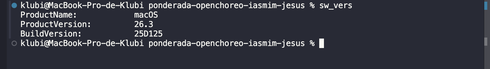 | Versão do macOS (`sw_vers`) |
| 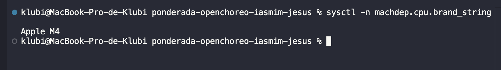 | Processador Apple Silicon M4 |
| 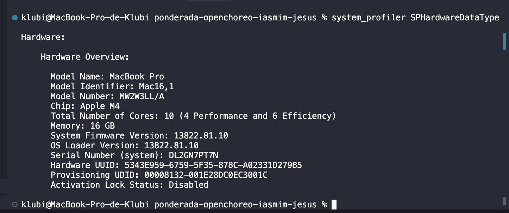 | Memória e núcleos físicos do equipamento |
| 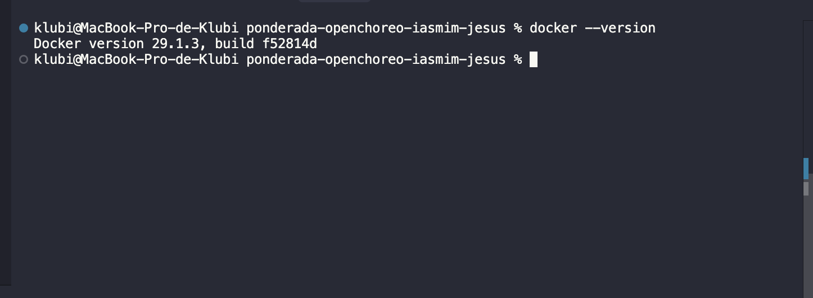 | Versão do Docker Client |
| 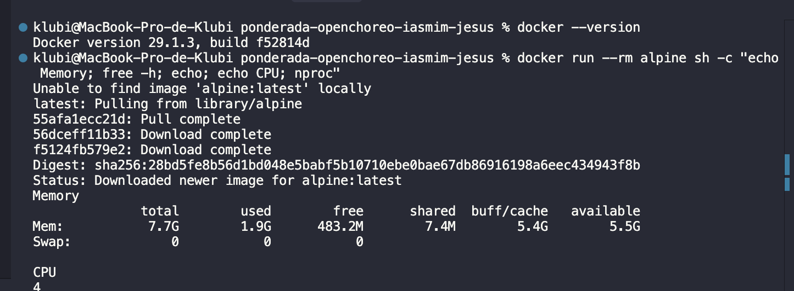 | CPUs (4) e memória (7,7 GB) dentro do container Alpine |

---

## 2. Instalação

### Comando para iniciar o Quick Start (Dev Container)

```bash
docker run --rm -it \
  --name openchoreo-quick-start \
  --pull always \
  -v /var/run/docker.sock:/var/run/docker.sock \
  --network=host \
  ghcr.io/openchoreo/quick-start:v1.1.1
```

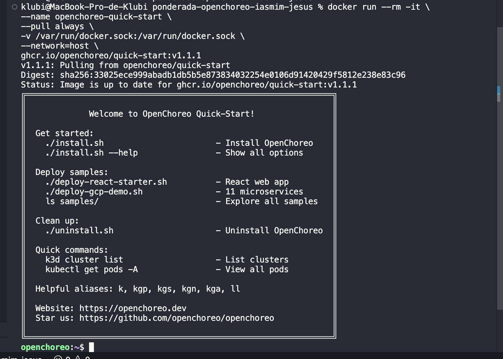

### Comando de instalação

Dentro do container Quick Start:

```bash
./install.sh --version v1.1.1
```

### Tempo aproximado

Cerca de **15 minutos**.

### Resultado da instalação

A instalação instalou com sucesso a maior parte dos componentes principais:

- cert-manager
- External Secrets Operator
- kgateway
- Thunder
- OpenChoreo Control Plane (7/8 pods em estado Ready)
- Cluster Gateway e Data Plane CA

Porém, o script **encerrou com erro** (`exit code 1`) porque o pod do **OpenBao** não atingiu o estado *Ready* dentro do tempo limite do readiness probe do Kubernetes (`OpenBao pod failed to become ready`).

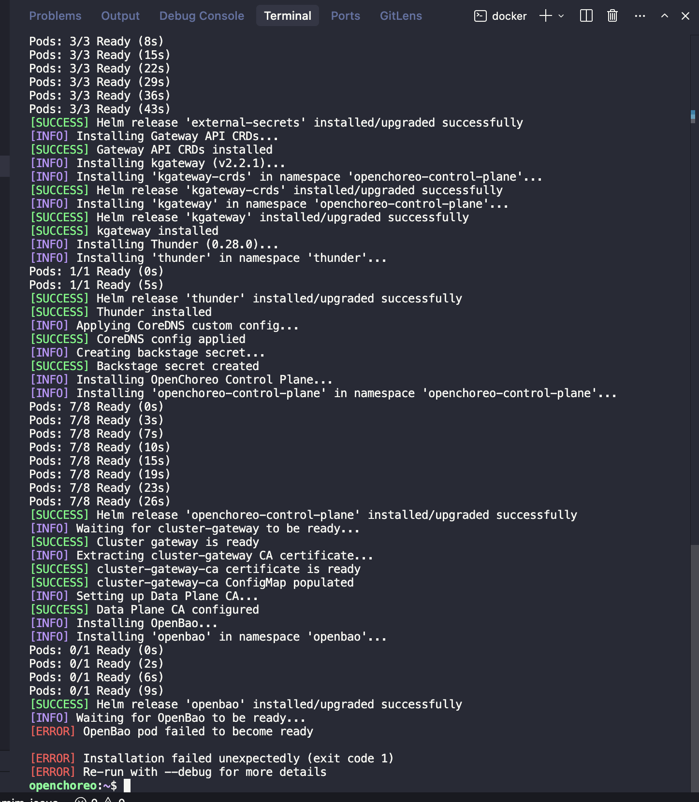

Após a instalação, o comando `./check-status.sh` mostrou que vários componentes ainda estavam em estado `[PENDING]` ou `[NOT STARTED]`, incluindo OpenBao, KGateway, Backstage e o Data Plane:

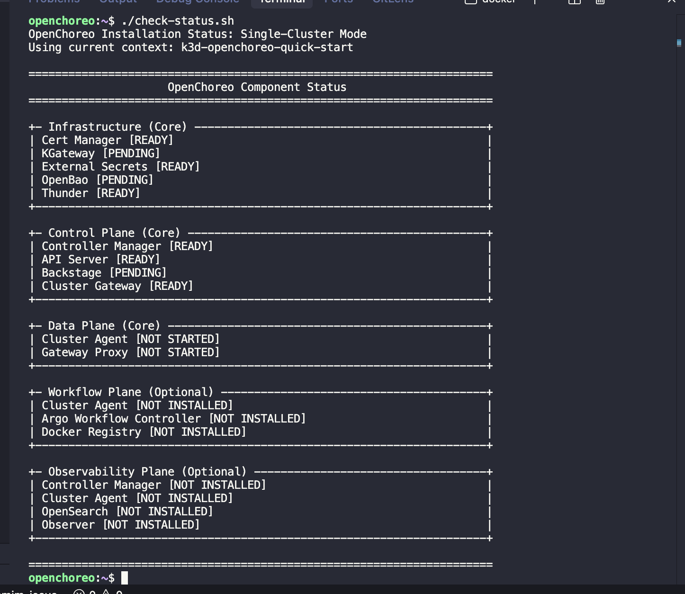

> **Correção em relação ao rascunho inicial:** a instalação **não** terminou com sucesso completo. Os componentes principais foram implantados, mas o script de instalação reportou falha por timeout no OpenBao. Mesmo assim, a interface web ficou acessível posteriormente (seção 3).

---

## 3. Validação da interface

| Campo | Valor |
|-------|-------|
| URL | http://openchoreo.localhost:8080 |
| Usuário | `admin@openchoreo.dev` |
| Senha | `Admin@123` |

A interface do OpenChoreo (baseada no Backstage) foi acessada com sucesso. O cabeçalho exibiu a mensagem **"Welcome, admin@openchoreo.dev!"**, confirmando o login.

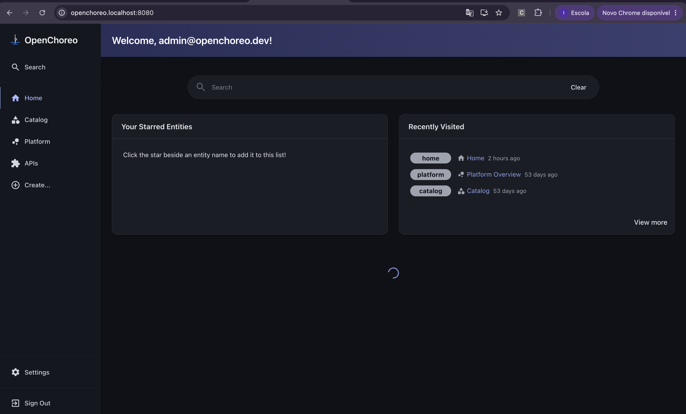

---

## 4. Publicação da aplicação

### Comando executado

```bash
./deploy-react-starter.sh
```

### Resultado

O script executou as etapas iniciais com sucesso:

1. **Componente criado** — `react-starter` no projeto `default`, tipo `deployment/web-application`
2. **Workload criado** — workload `react-starter` registrado na plataforma
3. **Falha na publicação** — ocorreu **timeout de 300 segundos** aguardando a sincronização do `ReleaseBinding`, etapa responsável por vincular o componente a um ambiente e concluir a publicação

Por esse motivo, a aplicação de exemplo **não foi publicada**.

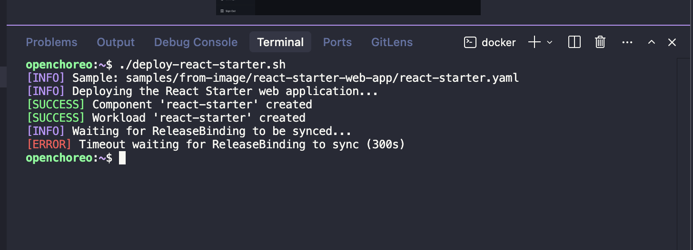

---

## 5. Recursos do Kubernetes

Para cada recurso, foram executados comandos `kubectl` dentro do container Quick Start.

### Namespaces

**Comando executado:**

```bash
kubectl get namespaces -l openchoreo.dev/control-plane=true
```

**Resultado:**

```
No resources found
```

**Explicação:** *Namespaces* são unidades de isolamento dentro do cluster Kubernetes. A label `openchoreo.dev/control-plane=true` seria usada para identificar namespaces pertencentes ao control plane do OpenChoreo. Na versão v1.1.1 testada, nenhum namespace retornou com essa label — ou seja, ela não é aplicada automaticamente da forma esperada por esse filtro.

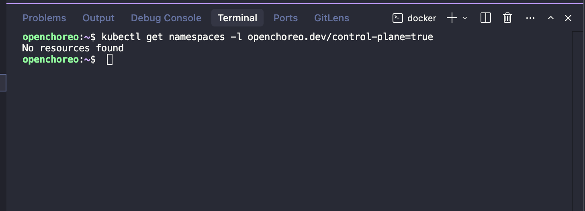

---

### ClusterDataPlanes

**Comando executado:**

```bash
kubectl get clusterdataplanes
```

**Resultado:**

```
No resources found
```

**Explicação:** *ClusterDataPlanes* representam os planos de dados onde as aplicações são efetivamente executadas. São clusters Kubernetes registrados no OpenChoreo para receber workloads. Nenhum data plane adicional foi configurado além do cluster local do Quick Start.

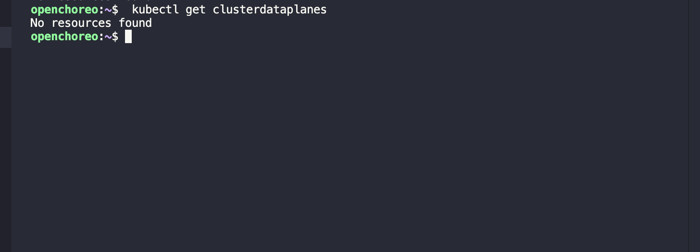

---

### Environments

**Comando executado:**

```bash
kubectl get environments
```

**Resultado:**

```
No resources found in default namespace.
```

**Explicação:** *Environments* (ambientes) representam contextos de execução das aplicações — por exemplo, development, staging e production. Eles são associados a data planes e projetos para definir **onde** cada versão de uma aplicação deve ser publicada. A ausência de environments está alinhada com a falha na sincronização do `ReleaseBinding` observada no deploy.

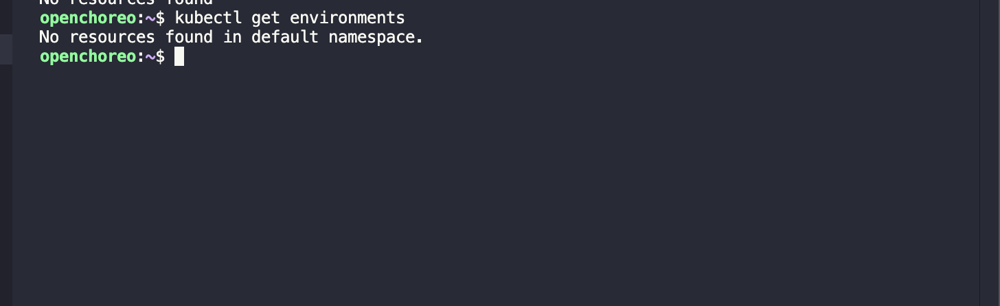

---

### Projects

**Comando executado:**

```bash
kubectl get projects
```

**Resultado:**

```
No resources found in default namespace.
```

**Explicação:** *Projects* (projetos) são unidades organizacionais no OpenChoreo que agrupam componentes e aplicações relacionadas. Funcionam como um domínio de negócio ou repositório lógico dentro da plataforma. Embora o componente `react-starter` referencie o projeto `default`, o recurso `Project` não apareceu listado nesse namespace.

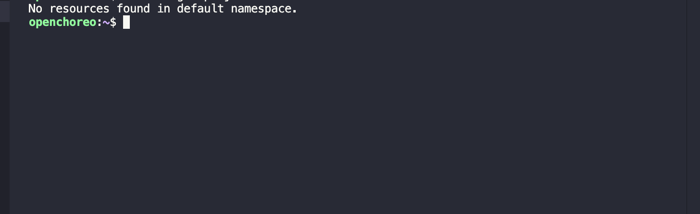

---

### ClusterComponentTypes

**Comando executado:**

```bash
kubectl get clustercomponenttypes
```

**Resultado:**

```
No resources found
```

**Explicação:** *ClusterComponentTypes* definem os tipos de componentes suportados pela plataforma em nível de cluster — como `web-application`, `service` e `scheduled-task`. Funcionam como templates que determinam como um componente é implantado e exposto. Nenhum tipo foi listado no momento da consulta.

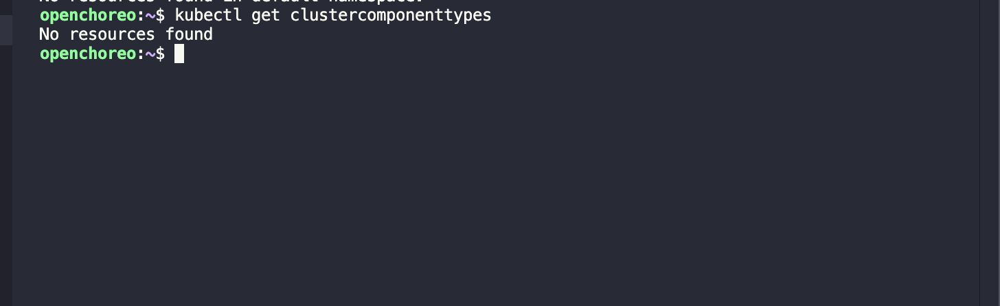

---

### Components

**Comando executado:**

```bash
kubectl get components
```

**Resultado:**

```
NAME            PROJECT   COMPONENTTYPE                AGE
react-starter   default   deployment/web-application   22m
```

**Explicação:** *Components* são as unidades implantáveis no OpenChoreo. Cada componente representa uma aplicação ou serviço, com seu tipo, projeto de origem e tempo desde a criação. O `react-starter` foi criado pelo script `deploy-react-starter.sh`, confirmando que a criação do componente ocorreu — mesmo com a publicação incompleta.

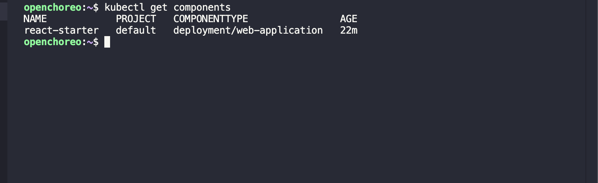

---

## 6. Limitações encontradas

1. **Instalação parcialmente concluída** — os componentes principais (cert-manager, External Secrets, kgateway, Thunder, Control Plane) foram instalados, mas o script `./install.sh` terminou com erro devido ao timeout do readiness probe do **OpenBao**.

2. **Interface acessível** — apesar da falha reportada pelo instalador, a interface do OpenChoreo ficou acessível em http://openchoreo.localhost:8080/, com login realizado usando as credenciais padrão.

3. **Componentes em estado pendente** — o `./check-status.sh` indicou OpenBao, KGateway e Backstage como `[PENDING]`, e o Data Plane como `[NOT STARTED]`, sugerindo que o ambiente local não atingiu plena estabilidade.

4. **Deploy não concluído** — o script `./deploy-react-starter.sh` criou o componente e o workload, mas a publicação falhou por **timeout de 300 s** na sincronização do `ReleaseBinding`. Sem essa etapa, a aplicação de exemplo não ficou disponível para acesso.

5. **Recursos de plataforma ausentes** — consultas a `environments`, `projects` e `clustercomponenttypes` não retornaram recursos, o que é consistente com um ambiente em que o fluxo de publicação não foi finalizado.

---

## Resumo

| Etapa | Status |
|-------|--------|
| Ambiente local (macOS + Colima + Docker) | Configurado |
| Quick Start + instalação v1.1.1 | Parcial — erro no OpenBao |
| Interface web | Acessível |
| Deploy `react-starter` | Componente e workload criados; publicação falhou (timeout ReleaseBinding) |
